### Lesson01: add game over screen
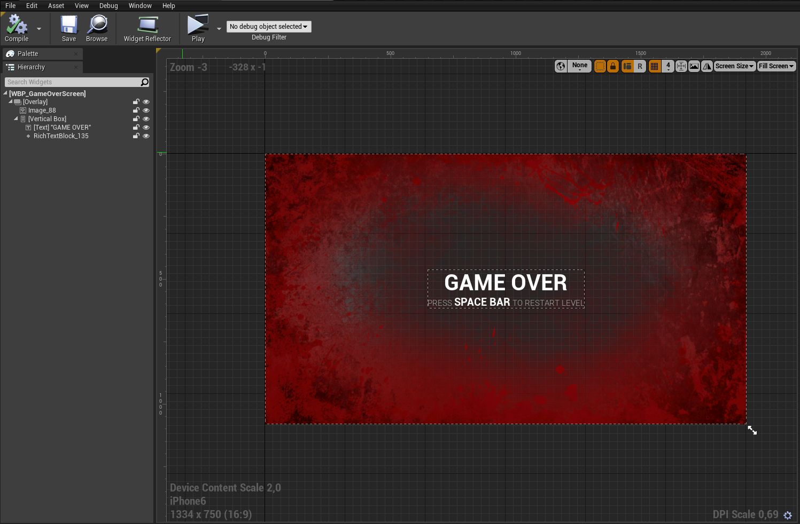

### Lesson02: add main menu && add enemy tank bars
##### Enemy Health Bar
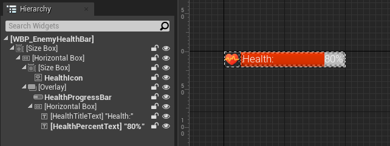

##### Enemy Status Bar
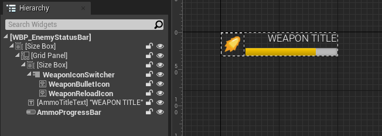

##### Main Menu
###### Struct
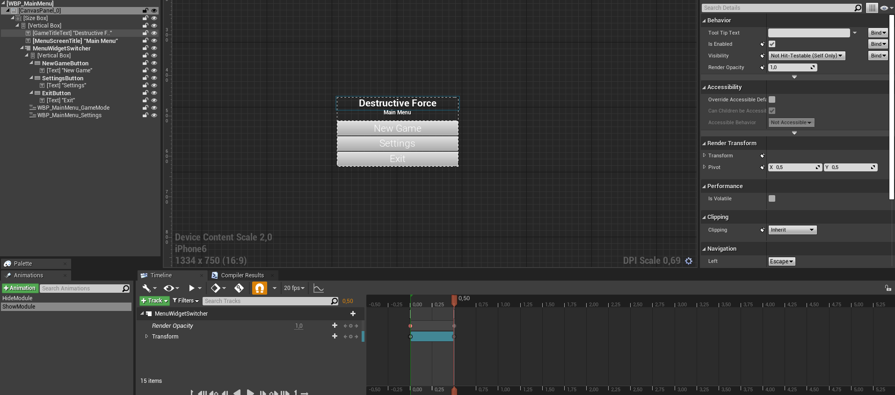
###### Module Switcher
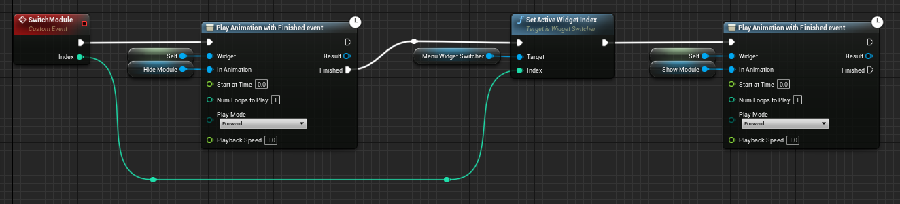
###### Create MM Widget
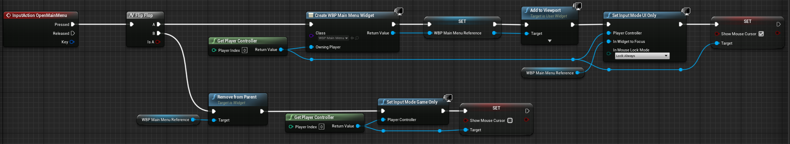
###### Demo

##### Other Widget
> Взял из другого своего проекта (задание **) UE5 правда...

##### Struct
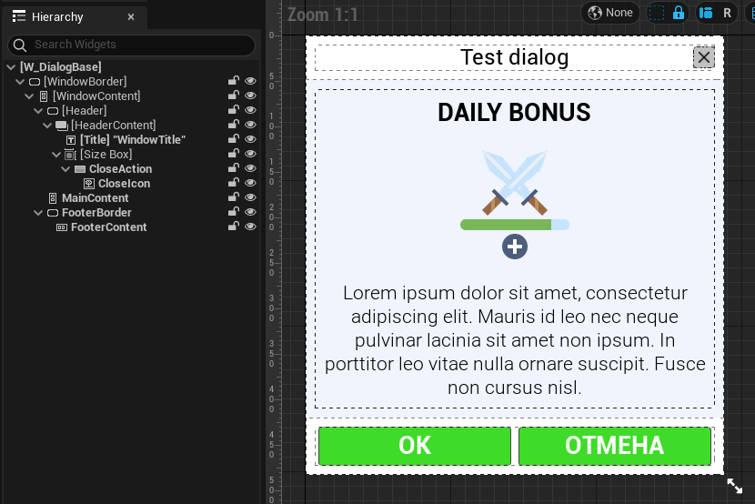
##### Generate Content
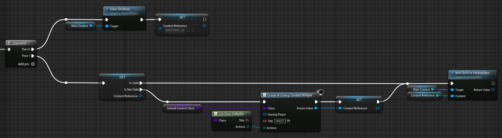
##### Generate Actions
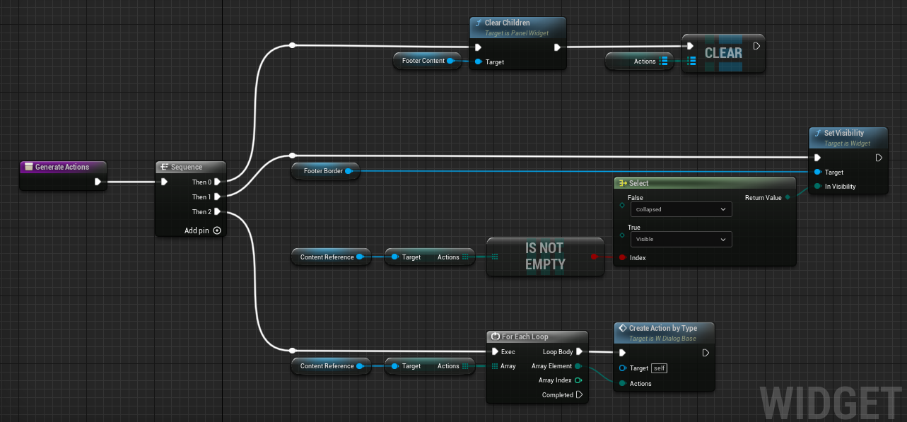

### Lesson03
##### Enemy Health Bar 3D
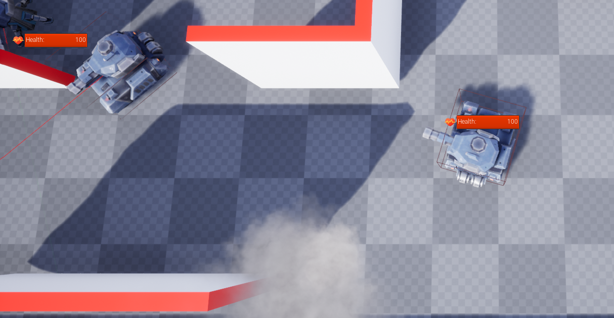

### Lesson04
##### Radio Button Group
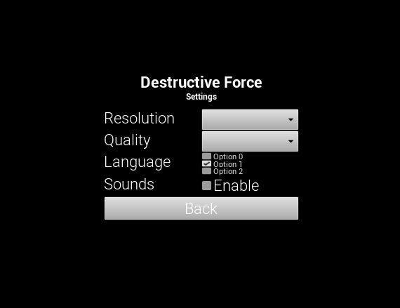
###### Minimap* (Youtube link)
