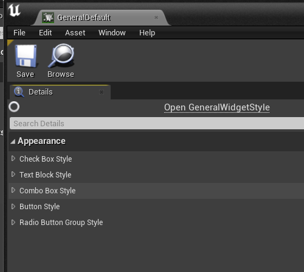
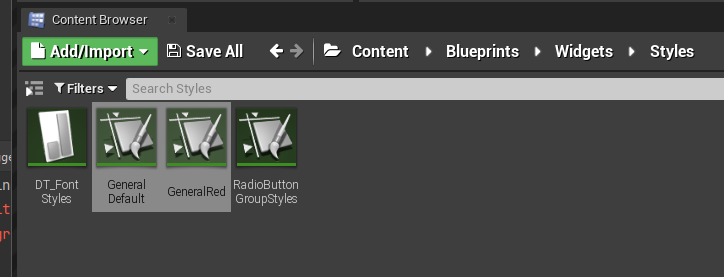
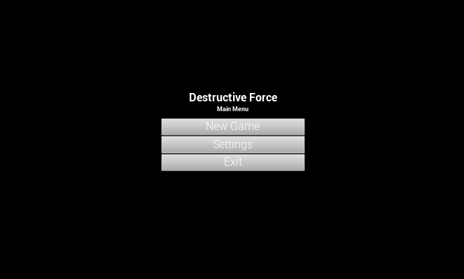
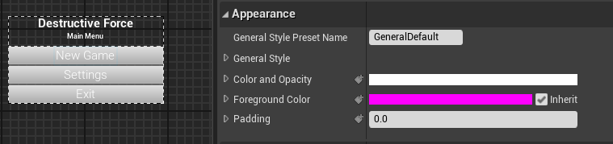
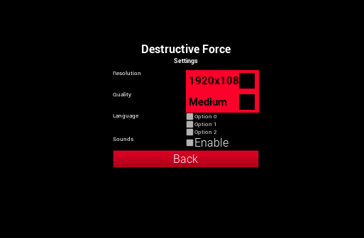
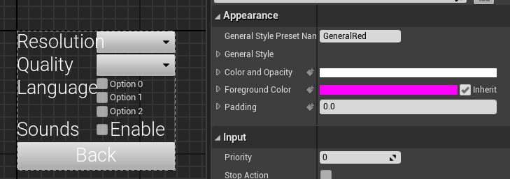
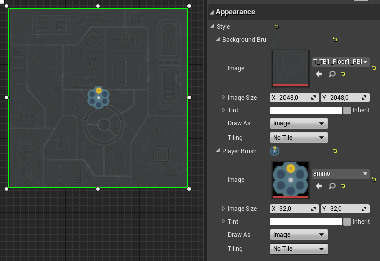
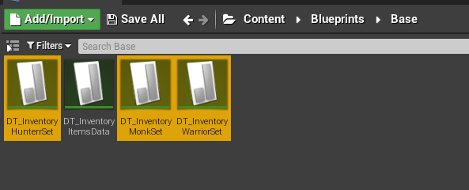
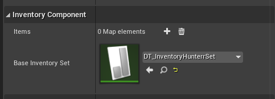
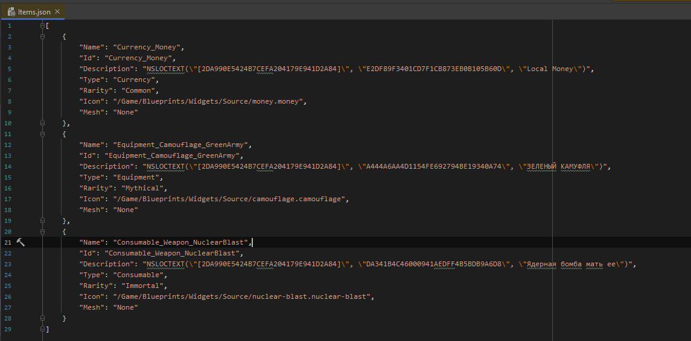

### Lesson01: add game over screen

### Lesson02: add main menu && add enemy tank bars
##### Enemy Health Bar

##### Enemy Status Bar

##### Main Menu
###### Struct

###### Module Switcher

###### Create MM Widget

###### Demo

##### Other Widget
> Взял из другого своего проекта (задание **) UE5 правда...

##### Struct

##### Generate Content

##### Generate Actions

### Lesson03
##### Enemy Health Bar 3D

### Lesson04
##### Radio Button Group

###### Minimap* (Youtube link)

### Lesson05
##### UMG Style

##### Switch two style set

###### MainMenuWidget

###### MainMenuSettingsWidget

##### Update style for minimap (*)

### Lesson06
##### Drag&Drop widget + Tooltip + ActorSpawner (Youtube Link)

### Lesson 07
##### Inventory Base + Drag&Drop + Filer (Youtube Link)

##### Inventory Presets

##### Inventory File Items (Import/Export from context menu in UE)
